# Monitoramento Zabbix na AWS — Terraform + Ansible


Plataforma de monitoramento **Zabbix 7.4** na AWS, **100% como código** com **Terraform** (infraestrutura) e **Ansible** (instalação/configuração). Stack completa com **VPC em 3 AZs**, **ALB + WAFv2** (proteção OWASP Top 10 + rate limiting), **EC2 em subnet privada**, banco **Aurora MySQL 8.0**, acesso seguro via **SSM Session Manager** (sem bastion host / porta 22 pública) e credenciais gerenciadas no **AWS Secrets Manager**.

> ⚠️ **Nota:** O código-fonte (Terraform + Ansible) é mantido no repositório privado [`zabbix-terraform-ansible`](https://github.com/ClenilsonSousa/zabbix-terraform-ansible). Este repositório público serve como portfólio documental com arquitetura, prints e resultados.

---

# 📑 Índice

- [Visão Geral](#-visão-geral)
- [Arquitetura](#-arquitetura)
- [Stack Tecnológica](#-stack-tecnológica)
- [Serviços AWS](#-serviços-aws)
- [Fluxo de Deploy](#-fluxo-de-deploy)
- [Segurança](#-segurança)
- [Prints da Infraestrutura](#-prints-da-infraestrutura)
- [Custos Mensais Estimados](#-custos-mensais-estimados)
- [Autor](#-autor)

---

# 📖 Visão Geral

Este projeto implementa uma **plataforma de monitoramento corporativa** com **Zabbix** na AWS, seguindo o **AWS Well-Architected Framework**. Toda a infraestrutura — da VPC ao Zabbix Server — é criada por **Terraform** e configurada por **Ansible**, sem dependências de recursos pré-existentes (apenas a zona Route 53):

| Pilar | Implementação |
|---|---|
| **Excelência Operacional** | IaC completo (Terraform + Ansible), scripts `deploy.sh`/`destroy.sh`, zero intervenção manual |
| **Segurança** | WAFv2 (4 regras), SSM Session Manager (sem SSH público), Secrets Manager, IAM least-privilege, criptografia em repouso |
| **Confiabilidade** | 3 AZs, ALB com health check, Aurora com backup de 7 dias e Performance Insights |
| **Eficiência** | Aurora MySQL (Graviton t4g), EC2 t3.medium, gp3 encrypted |
| **Otimização de Custos** | NAT Gateway x2 (ao invés de 3), Aurora single-AZ (portfólio), sem bastion host |

---

# 🏗️ Arquitetura

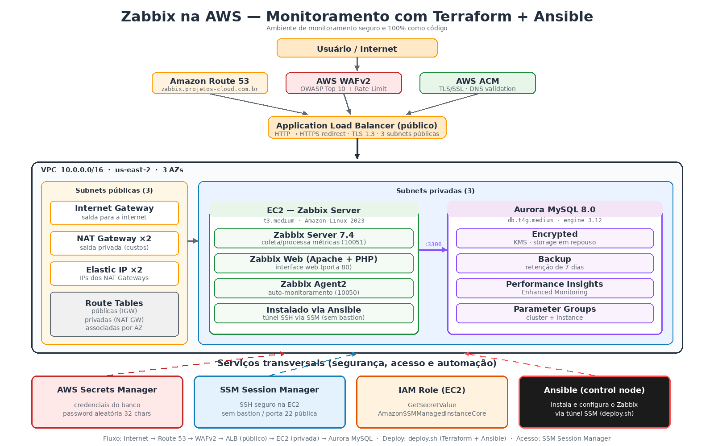

```
User ─► Route 53 ─► ACM TLS ─► WAFv2 ─► ALB (público)
                                          │
                                   ┌──────▼────────────────────────┐
                                   │   VPC 10.0.0.0/16 · 3 AZs    │
                                   │                               │
                                   │  Subnets públicas (3)         │
                                   │   ├─ Internet Gateway         │
                                   │   ├─ NAT Gateway ×2           │
                                   │   └─ Elastic IP ×2            │
                                   │                               │
                                   │  Subnets privadas (3)         │
                                   │   ├─ EC2 Zabbix Server        │
                                   │   │    t3.medium (AL2023)     │
                                   │   │    ├─ Zabbix Server 7.4   │
                                   │   │    ├─ Zabbix Web (Apache) │
                                   │   │    └─ Zabbix Agent2       │
                                   │   │          │ :3306          │
                                   │   └─ Aurora MySQL 8.0         │
                                   │        db.t4g.medium          │
                                   └───────────────────────────────┘

Cross-cutting: Secrets Manager · SSM Session Manager · IAM Role · Ansible (deploy)
```

---

# 🛠️ Stack Tecnológica

| Camada | Tecnologia |
|--------|-----------|
| **IaC** | Terraform 1.5+ (AWS provider ~> 6.0) |
| **Config Management** | Ansible (roles `zabbix-server` e `zabbix-agent`) |
| **Monitoring** | Zabbix Server 7.4 |
| **Web** | Apache + PHP (Zabbix Web UI) |
| **Database** | Aurora MySQL 8.0 (engine 3.12, Graviton t4g) |
| **Compute** | EC2 t3.medium — Amazon Linux 2023 |
| **Load Balancer** | Application Load Balancer (HTTP → HTTPS redirect) |
| **DNS / TLS** | Route 53 + ACM (validação DNS) |
| **Security** | WAFv2, Secrets Manager, IAM, SSM Session Manager |
| **Access** | SSM Session Manager (SSH sem bastion) |

---

# ☁️ Serviços AWS

| Serviço | Uso |
|---------|-----|
| **VPC** | 10.0.0.0/16, 3 AZs, 6 subnets (3 públicas + 3 privadas), NAT x2 |
| **EC2** | Instância única do Zabbix Server (t3.medium, subnet privada) |
| **Aurora MySQL** | Cluster 8.0 (db.t4g.medium), encrypted, backup 7 dias |
| **ALB** | Application Load Balancer público (HTTP→HTTPS, TLS 1.3) |
| **WAFv2** | 4 regras (OWASP, SQLi, IP Reputation, Rate Limit no login) |
| **Route 53** | Registro A → ALB (zabbix.projetos-cloud.com.br) |
| **ACM** | Certificado TLS (validação DNS) |
| **Secrets Manager** | Credenciais do banco (password aleatória de 32 chars) |
| **SSM** | Session Manager (acesso SSH sem porta 22 pública) |
| **IAM** | Role EC2 (GetSecretValue + AmazonSSMManagedInstanceCore) |
| **Elastic IP** | 2 EIPs para os NAT Gateways |

---

# 🚀 Fluxo de Deploy

O deploy é 100% automatizado e acontece em **2 fases** orquestradas pelo `deploy.sh`:

```bash
# Deploy completo: Terraform → inventário → SSM → Ansible
./scripts/deploy.sh

# Opções
./scripts/deploy.sh --skip-infra      # reutiliza a infra existente (só Ansible)
./scripts/deploy.sh --skip-ansible    # só cria a infra (pula configuração)

# Destroy completo
./scripts/destroy.sh
```

**Etapas do `deploy.sh`:**
1. **Terraform** cria a infraestrutura (VPC, ALB, WAF, EC2, Aurora, IAM, DNS)
2. Gera o **inventário Ansible** dinamicamente a partir dos outputs do Terraform
3. Aguarda a instância ficar **online no SSM**
4. **Ansible** conecta via túnel SSH sobre SSM e instala/configura: Zabbix Server 7.4, Zabbix Web (Apache + PHP) e Zabbix Agent2
5. Valida o acesso web e exibe as informações de acesso

**Pré-requisitos:**
- Terraform
- Ansible
- AWS CLI configurado
- Chave SSH (`terraform/keypair/hmg_zabbix`)

---

# 🔒 Segurança

| Camada | Proteção |
|--------|----------|
| **Perímetro** | WAFv2: Core Rule Set (OWASP Top 10) + SQLi + IP Reputation + Rate Limit (1000 req/5min no login) |
| **Rede** | VPC isolada, subnets privadas, NAT Gateway, Security Groups restritivos (somente portas necessárias) |
| **Acesso** | SSM Session Manager — **sem porta 22 exposta**, sem bastion host |
| **Dados** | Aurora + EBS criptografados (KMS), Secrets Manager para credenciais |
| **IAM** | Least-privilege: EC2 só lê o secret do banco + permissão SSM |
| **Transport** | ACM TLS no ALB (HTTP→HTTPS redirect) |

---

# 📸 Prints da Infraestrutura

### VPC & Networking
| VPC | Subnets | Route Tables |
|-----|---------|-------------|
| 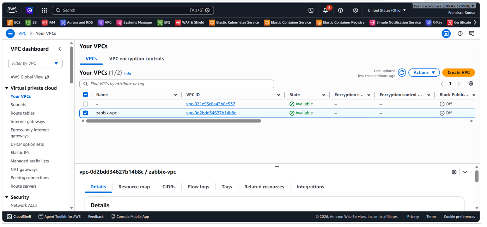 | 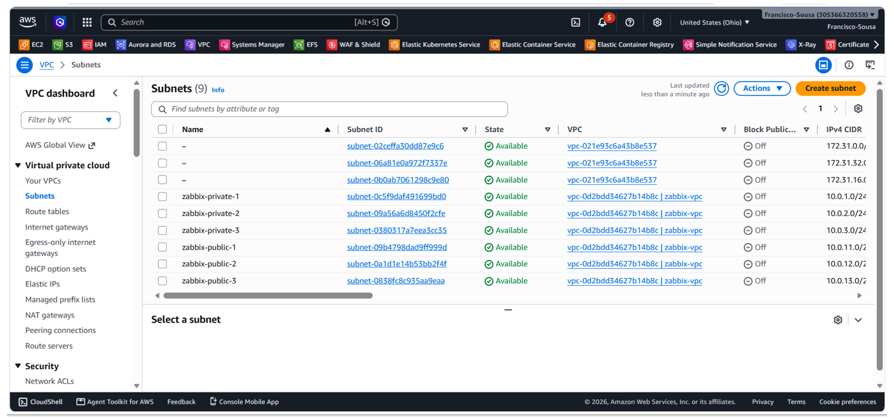 | 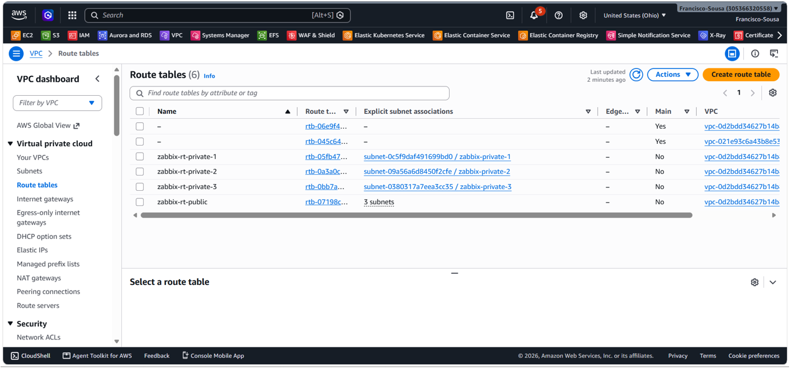 |

| Internet Gateway | NAT Gateway | Elastic IP |
|-----------------|-------------|------------|
| 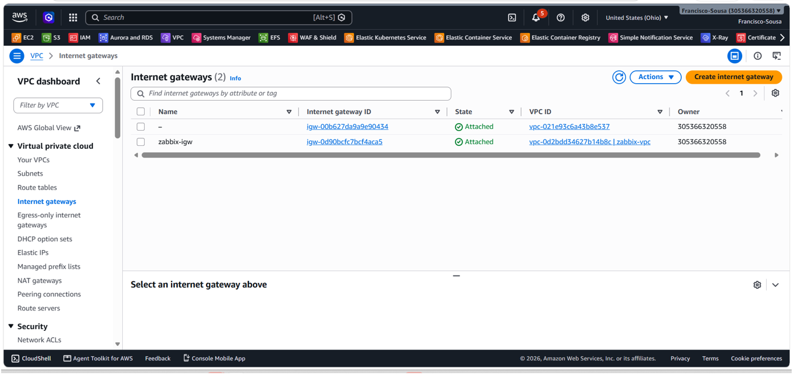 | 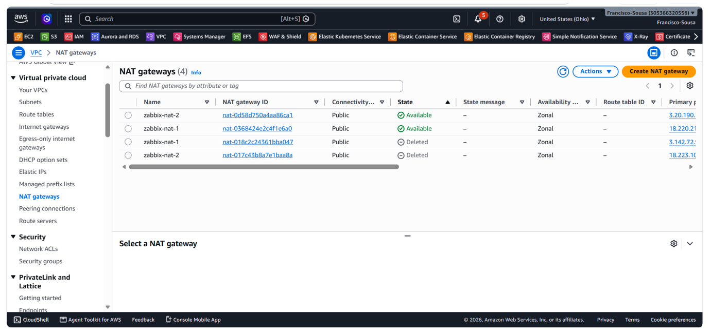 | 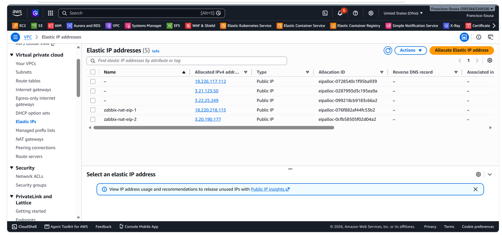 |

### Compute & Database
| EC2 (Zabbix Server) | Aurora MySQL | Security Group |
|---------------------|--------------|----------------|
| 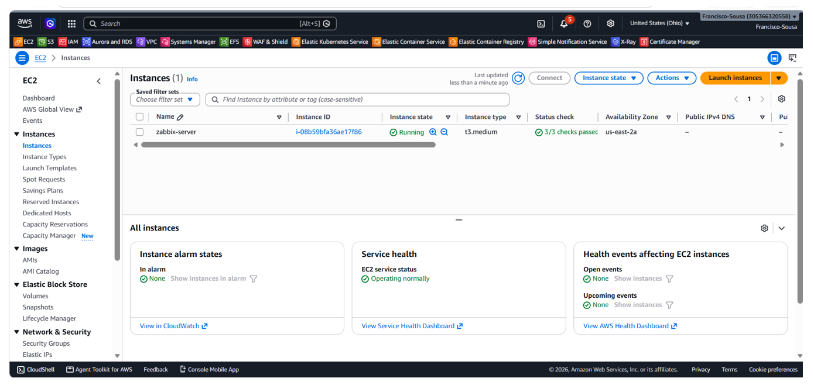 | 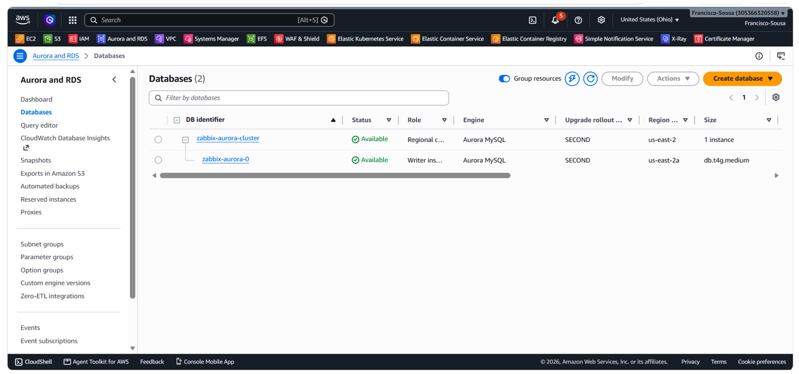 | 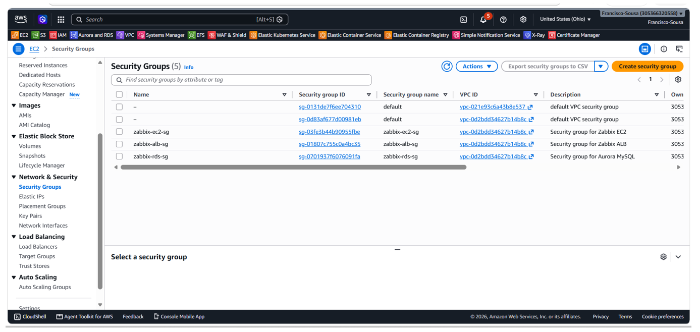 |

### Segurança & Acesso
| Secrets Manager | Session Manager | Systems Manager |
|-----------------|-----------------|-----------------|
| 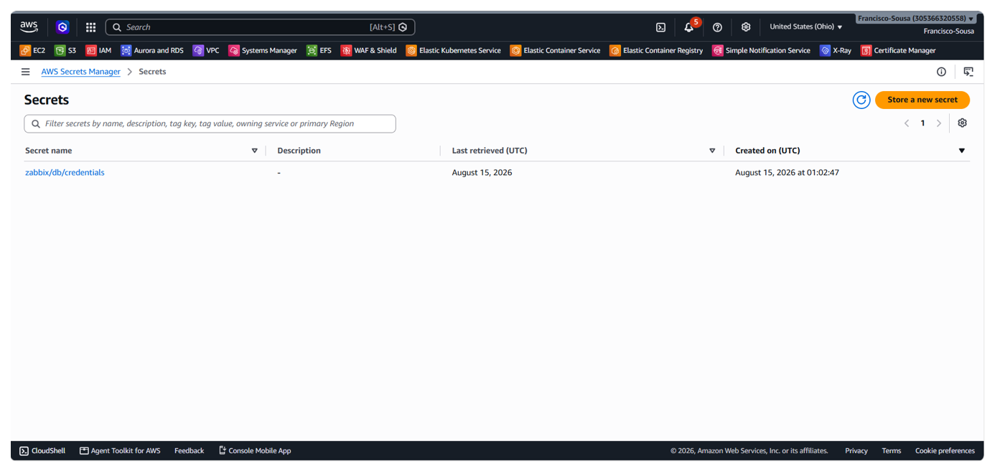 | 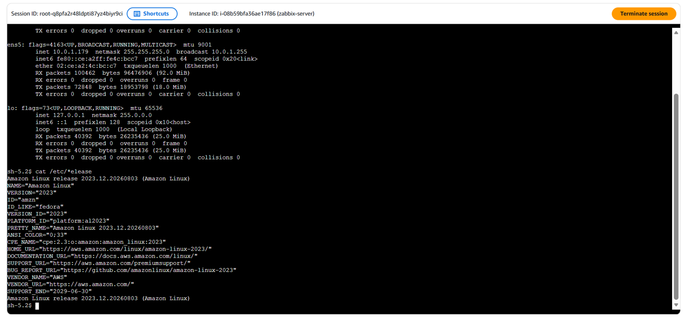 | 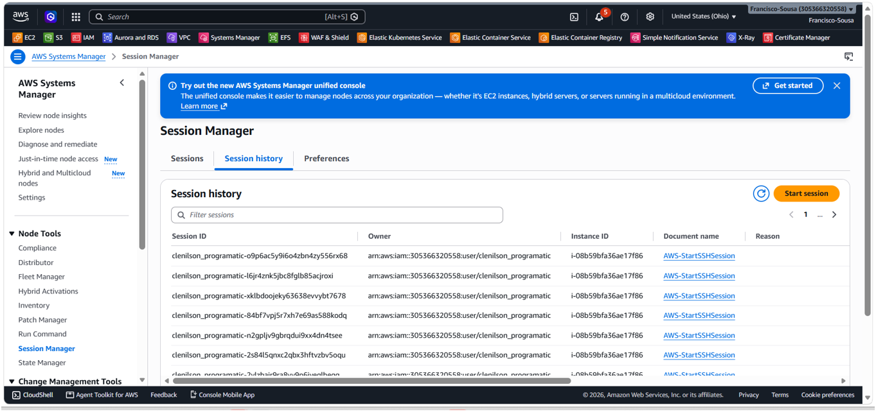 |

### Zabbix
| Login | Dashboard | Hosts |
|-------|-----------|-------|
| 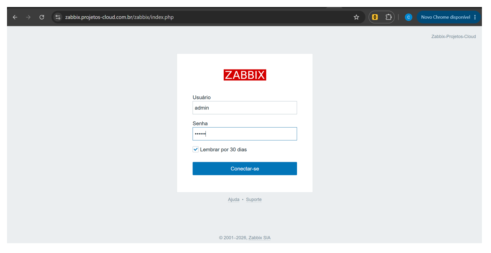 | 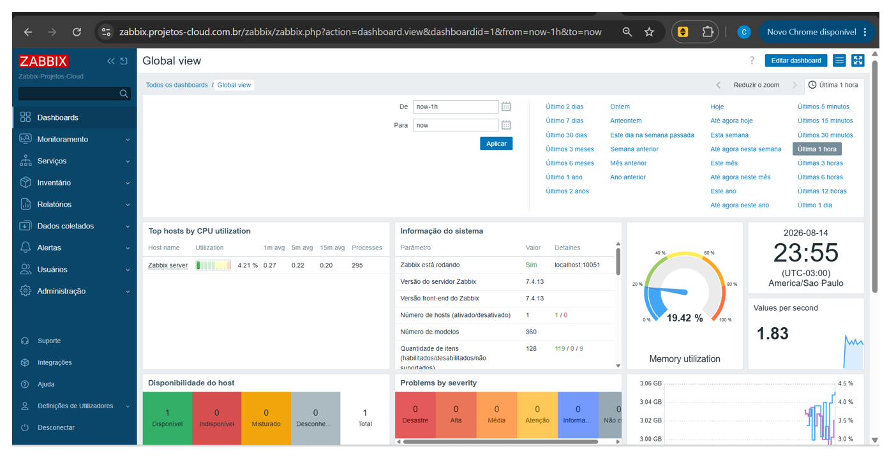 | 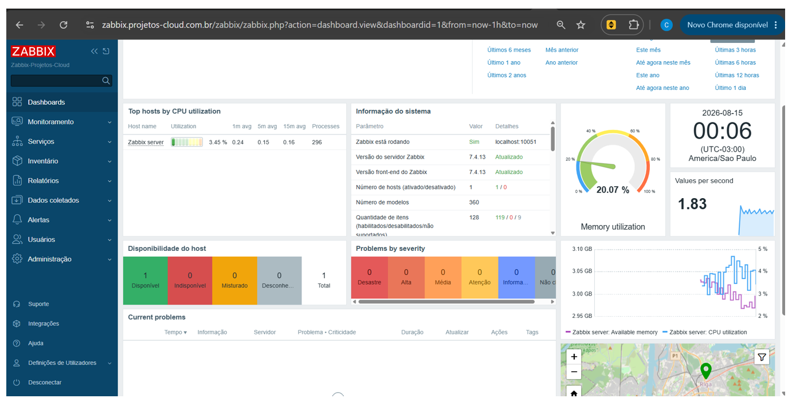 |

| Setup | Configuração DB | Usuários |
|-------|-----------------|----------|
| 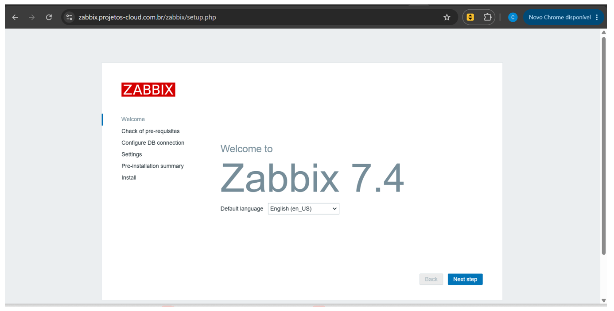 | 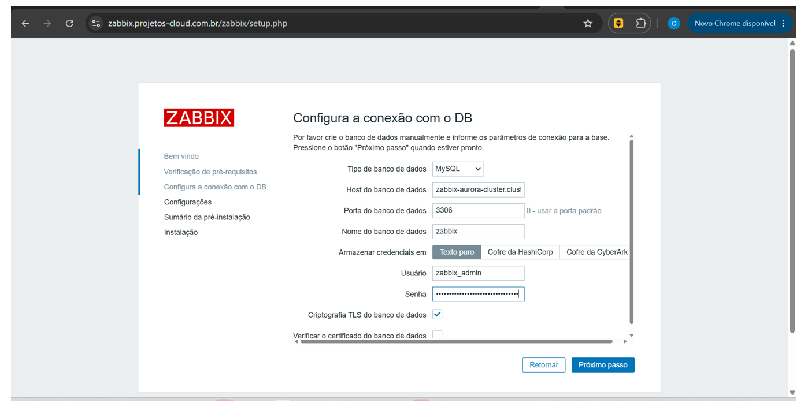 | 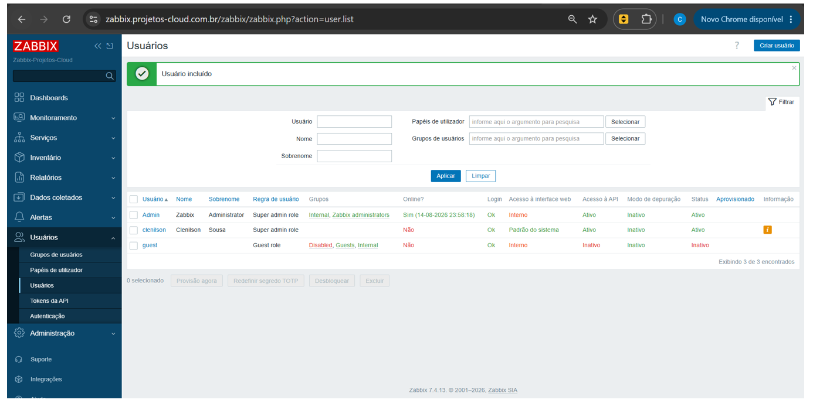 |

---

# 💰 Custos Mensais Estimados

| Recurso | Custo/mês |
|---------|-----------|
| EC2 t3.medium | ~$30 |
| Aurora MySQL db.t4g.medium | ~$60 |
| ALB | ~$22 |
| NAT Gateway x2 | ~$65 |
| WAFv2 (WebACL + regras) | ~$10 |
| Secrets Manager | ~$1 |
| Route 53 + ACM | ~$1 |
| EBS gp3 (30GB) | ~$3 |
| **Total estimado** | **~$190/mês** |

> *Valores para us-east-2, uso low-traffic (portfólio). Em produção, o custo aumentaria com Multi-AZ Aurora, mais storage e tráfego.*

---

# 👤 Autor

**Clenilson Sousa** — Engenheiro DevOps / Cloud

[](https://www.linkedin.com/in/clenilsonsousa/)
[](https://github.com/ClenilsonSousa)

---

### Projetos relacionados:
- [Grafana EKS Microservices (Observability)](https://github.com/ClenilsonSousa/grafana-eks-microservices-portfolio) — Observabilidade full-stack no EKS
- [Grafana EKS Kubernetes (Monolítico)](https://github.com/ClenilsonSousa/grafana-eks-k8s-portfolio) — Grafana HA no EKS com Aurora MySQL
- [Grafana ECS Fargate](https://github.com/ClenilsonSousa/grafana-ecs-fargate-portfolio) — Grafana HA no ECS Fargate
